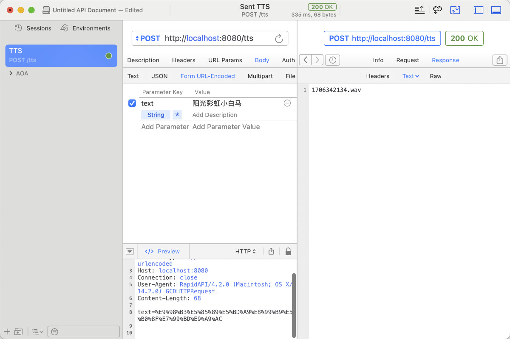

# Go Baidu Speech

API Service of Baidu **ASR** and **TTS**, support Docker.


## TTS



```bash
curl -X POST -d "text=阳光彩虹小白马" http://localhost:8080/tts
```

You will get a plain text return containing the file name: `1706342489.wav`. You can download the file using the full address: `http://localhost:8080/1706342489.wav`. Or access `http://localhost:8080/` get all files.

Python example:

```python
import requests
headers = {
    'Content-Type': 'application/x-www-form-urlencoded',
}
data = 'text=阳光彩虹小白马'.encode()
response = requests.post('http://127.0.0.1:8080/tts', headers=headers, data=data)
print(response.text)
```

## ASR

```bash
curl -X POST -F "file=@/Users/soulteary/Downloads/1706341924.wav" http://localhost:8080/asr
阳光彩虹小白马
```

Python example:

```python
import requests
files = {
    'file': open('1706341924.wav', 'rb'),
}
response = requests.post('http://127.0.0.1:8080/asr', files=files)
print(response.text)
```

## Docker

build it:

```bash
docker build -t soulteary/go-baidu-speech . -f docker/Dockerfile
```

play:

```bash
docker compose up -d
```

## Credit

- pkg: https://github.com/shanghuiyang/oauth / https://github.com/shanghuiyang/speech
